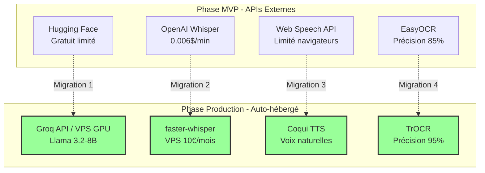

# Plan de Migration Technique MVP → Production
*Application d'apprentissage de la lecture - Infrastructure IA*

## 1. Vue d'ensemble de la migration

### 1.1 Objectifs de la migration

**Objectifs techniques :**
- Réduire la latence de 3s → <500ms
- Garantir 99.9% de disponibilité
- Éliminer les cold starts
- Maîtriser les coûts d'exploitation

**Objectifs business :**
- Passage de 100 → 1000+ utilisateurs simultanés
- Réduction coûts opérationnels de 60%
- Amélioration satisfaction utilisateur (NPS +20%)
- Préparation scaling international

### 1.2 Architecture cible



## 2. Planning détaillé par composant

### 2.1 Migration 1 : LLM (Semaines 17-19)

#### Phase de préparation (Semaine 17)

**Benchmark et validation**
- Comparaison Hugging Face vs Groq API
- Tests de performance sur corpus pédagogique
- Évaluation qualité génération de contenu
- Analyse coûts/bénéfices VPS dédié

```typescript
// Benchmark automatisé
interface BenchmarkResult {
  provider: 'huggingface' | 'groq' | 'vps-gpu';
  latency: number;        // ms
  tokensPerSecond: number;
  qualityScore: number;   // 0-1
  costPerRequest: number; // €
  availability: number;   // %
}

const benchmarkLLM = async (): Promise<BenchmarkResult[]> => {
  const testPrompts = await getEducationalTestPrompts();
  const results = [];
  
  for (const provider of ['huggingface', 'groq', 'vps-gpu']) {
    const metrics = await runProviderBenchmark(provider, testPrompts);
    results.push(metrics);
  }
  
  return results;
};
```

**Critères de décision Migration 1**
```typescript
interface MigrationCriteria {
  latencyImprovement: '>50% reduction';     // 3s → <1.5s
  costEfficiency: '>30% monthly savings';  // vs HF usage croissant
  qualityMaintained: '>95% content quality'; // Validation pédagogique
  availability: '>99.5% uptime';           // SLA critique
}
```

#### Implémentation hybride (Semaine 18)

**Configuration A/B Testing**
```typescript
// Configuration router intelligent
class LLMRouter {
  private config = {
    mvpProvider: 'huggingface',
    productionProvider: 'groq',
    migrationPercentage: 0 // 0-100%
  };

  async generateContent(prompt: string, studentId: string): Promise<string> {
    const useProduction = this.shouldUseProduction(studentId);
    
    if (useProduction) {
      try {
        const result = await this.groqClient.generate(prompt);
        await this.logMigrationMetrics('groq', 'success', result.latency);
        return result.content;
      } catch (error) {
        // Fallback automatique vers MVP
        console.warn('Groq fallback to HF:', error);
        return await this.huggingFaceClient.generate(prompt);
      }
    } else {
      return await this.huggingFaceClient.generate(prompt);
    }
  }

  private shouldUseProduction(studentId: string): boolean {
    // A/B testing basé sur hash stable du studentId
    const hash = this.hashStudentId(studentId);
    return (hash % 100) < this.config.migrationPercentage;
  }
}
```

#### Finalisation migration (Semaine 19)

**Migration complète si critères validés**
- Passage 100% des requêtes vers Groq/VPS
- Désactivation progressive Hugging Face
- Monitoring intensif performance
- Plan de rollback immédiat si nécessaire

### 2.2 Migration 2 : Reconnaissance Vocale (Semaines 20-22)

#### Setup infrastructure VPS (Semaine 20)

**Configuration VPS GPU Contabo**
```bash
# Setup faster-whisper sur VPS GPU
# VPS: 16 vCPU, 32GB RAM, RTX 4080, 400GB NVMe
# Coût: ~50€/mois vs ~100€/mois OpenAI à 1000 users

# Installation CUDA et dépendances
sudo apt update && apt install -y nvidia-driver-470 cuda-toolkit-11.8
pip install faster-whisper torch torchaudio

# Configuration service
cat > /etc/systemd/system/whisper-api.service << EOF
[Unit]
Description=Faster Whisper API Service
After=network.target

[Service]
Type=simple
User=whisper
WorkingDirectory=/opt/whisper-api
ExecStart=/opt/whisper-api/venv/bin/python app.py
Restart=always
RestartSec=10

[Install]
WantedBy=multi-user.target
EOF
```

**API Service Whisper**
```python
# /opt/whisper-api/app.py
from faster_whisper import WhisperModel
from flask import Flask, request, jsonify
import time
import logging

app = Flask(__name__)

# Chargement modèle optimisé pour voix enfants
model = WhisperModel("large-v3", device="cuda", compute_type="float16")

@app.route('/transcribe', methods=['POST'])
def transcribe():
    start_time = time.time()
    
    try:
        audio_file = request.files['audio']
        target_language = request.form.get('language', 'fr')
        
        # Transcription optimisée
        segments, info = model.transcribe(
            audio_file, 
            language=target_language,
            initial_prompt="Voici un enfant français qui lit à voix haute:",
            condition_on_previous_text=False
        )
        
        # Extraction du texte
        text = ' '.join([segment.text for segment in segments])
        
        latency = (time.time() - start_time) * 1000  # ms
        
        return jsonify({
            'text': text.strip(),
            'language': info.language,
            'confidence': info.language_probability,
            'latency_ms': latency
        })
        
    except Exception as e:
        logging.error(f"Transcription error: {e}")
        return jsonify({'error': str(e)}), 500

if __name__ == '__main__':
    app.run(host='0.0.0.0', port=8001, threaded=True)
```

#### Migration progressive (Semaine 21)

**Dual-path avec monitoring**
```typescript
// Service de reconnaissance hybride
class SpeechRecognitionService {
  private config = {
    useVPS: false,          // Switch de migration
    vpsEndpoint: 'https://whisper.contabo.com/transcribe',
    fallbackToOpenAI: true, // Sécurité
    maxLatencyMs: 2000      // SLA
  };

  async recognizeSpeech(audioBlob: Blob, targetWord: string): Promise<TranscriptionResult> {
    const startTime = Date.now();
    
    if (this.config.useVPS) {
      try {
        const vpsResult = await this.transcribeVPS(audioBlob);
        const latency = Date.now() - startTime;
        
        await this.logMetrics('vps-whisper', latency, vpsResult.confidence);
        
        if (latency > this.config.maxLatencyMs) {
          console.warn(`VPS latency exceeded: ${latency}ms`);
        }
        
        return vpsResult;
      } catch (error) {
        console.error('VPS transcription failed:', error);
        
        if (this.config.fallbackToOpenAI) {
          return await this.transcribeOpenAI(audioBlob);
        } else {
          throw error;
        }
      }
    } else {
      return await this.transcribeOpenAI(audioBlob);
    }
  }

  private async transcribeVPS(audioBlob: Blob): Promise<TranscriptionResult> {
    const formData = new FormData();
    formData.append('audio', audioBlob);
    formData.append('language', 'fr');
    
    const response = await fetch(this.config.vpsEndpoint, {
      method: 'POST',
      body: formData,
      timeout: this.config.maxLatencyMs
    });
    
    if (!response.ok) {
      throw new Error(`VPS API error: ${response.status}`);
    }
    
    return await response.json();
  }
}
```

#### Validation et bascule (Semaine 22)

**Critères de validation Migration 2**
- Latence moyenne <1s (vs 1-2s OpenAI)
- Précision >95% sur corpus enfants français
- Disponibilité >99.5%
- Coût <50% vs OpenAI API

### 2.3 Migration 3 : Synthèse Vocale (Semaines 23-24)

#### Setup Coqui TTS (Semaine 23)

**Installation modèles français enfants**
```bash
# Installation Coqui TTS avec modèles français
pip install TTS

# Téléchargement modèles optimisés
python -m TTS.bin.download_models --list
python -m TTS.bin.download_models --model_name "tts_models/fr/css10/vits"

# Configuration service TTS
cat > /opt/tts-api/config.json << EOF
{
  "models": {
    "fr-female-clear": "tts_models/fr/css10/vits",
    "fr-male-gentle": "tts_models/fr/mai/tacotron2-DDC"
  },
  "default_voice": "fr-female-clear",
  "sample_rate": 22050,
  "audio_format": "wav"
}
EOF
```

**Service TTS API**
```python
# /opt/tts-api/app.py
from TTS.api import TTS
from flask import Flask, request, send_file
import io
import tempfile

app = Flask(__name__)

# Initialisation modèles
tts_models = {
    'fr-female-clear': TTS(model_name="tts_models/fr/css10/vits"),
    'fr-male-gentle': TTS(model_name="tts_models/fr/mai/tacotron2-DDC")
}

@app.route('/synthesize', methods=['POST'])
def synthesize():
    try:
        data = request.json
        text = data['text']
        voice = data.get('voice', 'fr-female-clear')
        speed = data.get('speed', 1.0)
        
        if voice not in tts_models:
            return {'error': 'Voice not available'}, 400
        
        # Génération audio
        with tempfile.NamedTemporaryFile(suffix='.wav', delete=False) as tmp_file:
            tts_models[voice].tts_to_file(
                text=text,
                file_path=tmp_file.name,
                speed=speed
            )
            
            return send_file(
                tmp_file.name,
                mimetype='audio/wav',
                as_attachment=True,
                download_name='speech.wav'
            )
            
    except Exception as e:
        return {'error': str(e)}, 500
```

#### Migration frontend (Semaine 24)

**Service TTS hybride**
```typescript
class TextToSpeechService {
  private config = {
    useCustomTTS: false,
    customEndpoint: 'https://tts.contabo.com/synthesize',
    fallbackToWebSpeech: true
  };

  async speakText(text: string, options: TTSOptions = {}): Promise<void> {
    if (this.config.useCustomTTS) {
      try {
        return await this.speakCustomTTS(text, options);
      } catch (error) {
        console.warn('Custom TTS failed, fallback to Web Speech:', error);
        if (this.config.fallbackToWebSpeech) {
          return await this.speakWebSpeech(text, options);
        }
      }
    } else {
      return await this.speakWebSpeech(text, options);
    }
  }

  private async speakCustomTTS(text: string, options: TTSOptions): Promise<void> {
    const response = await fetch(this.config.customEndpoint, {
      method: 'POST',
      headers: { 'Content-Type': 'application/json' },
      body: JSON.stringify({
        text,
        voice: options.voice || 'fr-female-clear',
        speed: options.speed || 1.0
      })
    });

    if (!response.ok) {
      throw new Error(`TTS API error: ${response.status}`);
    }

    const audioBlob = await response.blob();
    const audioUrl = URL.createObjectURL(audioBlob);
    
    return new Promise((resolve, reject) => {
      const audio = new Audio(audioUrl);
      audio.onended = () => {
        URL.revokeObjectURL(audioUrl);
        resolve();
      };
      audio.onerror = reject;
      audio.play();
    });
  }
}
```

### 2.4 Migration 4 : Vision et OCR (Semaines 25-26)

#### Upgrade modèles vision (Semaine 25)

**Installation TrOCR optimisé manuscrit**
```python
# /opt/vision-api/app.py
from transformers import TrOCRProcessor, VisionEncoderDecoderModel
import torch
from PIL import Image
import cv2
import numpy as np

# Chargement modèle TrOCR spécialisé manuscrit
processor = TrOCRProcessor.from_pretrained("microsoft/trocr-base-handwritten")
model = VisionEncoderDecoderModel.from_pretrained("microsoft/trocr-base-handwritten")

# YOLO pour détection préalable
yolo_model = YOLO('yolov8n.pt')

@app.route('/analyze_writing', methods=['POST'])
def analyze_writing():
    try:
        image_file = request.files['image']
        target_letter = request.form.get('target_letter', '')
        
        # Conversion et préprocessing
        image = Image.open(image_file.stream)
        cv_image = cv2.cvtColor(np.array(image), cv2.COLOR_RGB2BGR)
        
        # Détection zones d'écriture avec YOLO
        results = yolo_model(cv_image)
        writing_regions = extract_writing_regions(results, cv_image)
        
        # OCR avec TrOCR sur chaque région
        recognized_letters = []
        for region in writing_regions:
            region_pil = Image.fromarray(cv2.cvtColor(region, cv2.COLOR_BGR2RGB))
            
            # TrOCR inference
            pixel_values = processor(region_pil, return_tensors="pt").pixel_values
            generated_ids = model.generate(pixel_values)
            generated_text = processor.batch_decode(generated_ids, skip_special_tokens=True)[0]
            
            recognized_letters.append({
                'text': generated_text,
                'confidence': calculate_confidence(pixel_values, generated_ids),
                'bbox': get_region_bbox(region)
            })
        
        # Analyse qualité vs lettre cible
        analysis = analyze_writing_quality(recognized_letters, target_letter)
        
        return jsonify(analysis)
        
    except Exception as e:
        return {'error': str(e)}, 500
```

#### Tests comparatifs (Semaine 26)

**Validation TrOCR vs EasyOCR**
```typescript
// Tests automatisés de précision OCR
interface OCRBenchmark {
  model: 'easyocr' | 'trocr';
  accuracy: number;
  processingTime: number;
  confidenceScore: number;
  childHandwritingAccuracy: number;
}

const benchmarkOCR = async (): Promise<OCRBenchmark[]> => {
  const testImages = await loadChildHandwritingDataset();
  const results = [];
  
  for (const model of ['easyocr', 'trocr']) {
    const metrics = await testOCRModel(model, testImages);
    results.push(metrics);
  }
  
  // Critères de décision
  const migrationCriteria = {
    accuracyImprovement: '>10%',     // 85% → 95%
    childSpecificAccuracy: '>90%',   // Manuscrit enfants
    latencyAcceptable: '<3s',        // Processing time
    integrationComplexity: 'medium'  // Effort développement
  };
  
  return results;
};
```

## 3. Gestion des risques et rollback

### 3.1 Plan de rollback par migration

#### Rollback Migration 1 (LLM)
```typescript
// Switch automatique en cas de problème
class EmergencyRollback {
  private healthChecks = {
    groqAPI: false,
    huggingFaceAPI: true,
    responseQuality: true
  };

  async checkSystemHealth(): Promise<boolean> {
    // Vérification Groq API
    try {
      const testResponse = await this.groqClient.generateTest();
      this.healthChecks.groqAPI = testResponse.success;
    } catch (error) {
      this.healthChecks.groqAPI = false;
    }

    // Vérification qualité réponses
    const qualityCheck = await this.validateResponseQuality();
    this.healthChecks.responseQuality = qualityCheck.score > 0.8;

    return Object.values(this.healthChecks).every(check => check);
  }

  async executeRollback(component: 'llm' | 'stt' | 'tts' | 'vision'): Promise<void> {
    console.warn(`Executing rollback for ${component}`);
    
    switch (component) {
      case 'llm':
        await this.rollbackToHuggingFace();
        break;
      case 'stt':
        await this.rollbackToOpenAIWhisper();
        break;
      // ... autres composants
    }
    
    await this.notifyTeam(`Rollback executed for ${component}`);
  }
}
```

### 3.2 Critères d'alerte et monitoring

#### Dashboard de migration
```typescript
interface MigrationMetrics {
  component: string;
  status: 'mvp' | 'migrating' | 'production' | 'rollback';
  healthScore: number;      // 0-100
  latencyP95: number;       // ms
  errorRate: number;        // %
  costEfficiency: number;   // vs baseline
  userSatisfaction: number; // NPS-like
}

// Alertes automatiques
const ALERT_THRESHOLDS = {
  latencyP95: 2000,        // >2s = alerte
  errorRate: 5,            // >5% = alerte critique
  healthScore: 80,         // <80% = investigation
  userSatisfaction: 7      // <7/10 = attention
};
```

## 4. Coûts détaillés et ROI

### 4.1 Analyse coûts par phase

#### Coûts MVP (Baseline)
```typescript
interface MVPCosts {
  huggingFace: {
    freeRequests: 1000,          // par mois
    paidAfter: '0.02€/request',
    estimatedMonthly: '100€'     // à 1000 users
  };
  
  openAIWhisper: {
    costPerMinute: 0.006,        // $
    avgRequestDuration: 10,      // secondes
    estimatedMonthly: '180€'     // à 1000 users
  };
  
  webSpeechAPI: {
    cost: 0,                     // Gratuit
    limitations: 'Browser dependent'
  };
  
  easyOCR: {
    cost: 0,                     // Gratuit
    performance: '85% accuracy'
  };
  
  totalMVP: '280€/mois'
}
```

#### Coûts Production (Cible)
```typescript
interface ProductionCosts {
  vpsGPU: {
    contaboInstance: '50€/mois',
    bandwidth: '10€/mois',
    maintenance: '20€/mois'
  };
  
  groqAPI: {
    costPer1000Tokens: '0.27$',
    estimatedMonthly: '80€'      // à 1000 users
  };
  
  development: {
    migrationEffort: '40h × 60€ = 2400€',  // One-time
    testing: '20h × 60€= 1200€'            // One-time
  };
  
  totalProduction: '160€/mois'  // Économie 120€/mois
}
```

### 4.2 ROI Analysis

#### Break-even calculation
```typescript
const migrationROI = {
  oneTimeCosts: 3600,          // €, dev + testing
  monthlySavings: 120,         // €
  breakEvenMonths: 30,         // 3600/120 = 30 mois
  
  yearlyROI: {
    year1: -2160,              // 3600 - (120×12)
    year2: 1440,               // 120×12
    year3: 1440,               // 120×12
    totalYear1to3: 720         // ROI positif sur 3 ans
  },
  
  scalingBenefits: {
    at10000users: '800€/mois savings',
    at50000users: '3200€/mois savings'
  }
};
```

## 5. Checklist opérationnelle

### 5.1 Pre-migration checklist

#### Semaine 16 - Préparation
- [ ] **Infrastructure** : VPS Contabo commandé et configuré
- [ ] **Équipe** : Formation équipe sur nouvelles technologies
- [ ] **Monitoring** : Dashboard de migration déployé
- [ ] **Tests** : Suite de tests automatisés prête
- [ ] **Backup** : Sauvegarde complète configuration MVP
- [ ] **Communication** : Stakeholders informés du planning

#### Validation technique
```bash
# Checklist automatisée
#!/bin/bash
echo "🔍 Validation pré-migration..."

# VPS accessibility
ping -c 3 vps.contabo.com || echo "❌ VPS not reachable"

# GPU availability
ssh vps.contabo.com "nvidia-smi" || echo "❌ GPU not available"

# Docker services
ssh vps.contabo.com "docker ps" | grep -E "(whisper|tts|vision)" || echo "❌ Services not running"

# API endpoints
curl -f https://whisper.contabo.com/health || echo "❌ Whisper API down"
curl -f https://tts.contabo.com/health || echo "❌ TTS API down"

echo "✅ Pré-migration validation complete"
```

### 5.2 Migration checklist par composant

#### Migration 1 : LLM (Checklist)
- [ ] **Week 17.1** : Benchmark Groq vs HF performance
- [ ] **Week 17.2** : Validation qualité génération contenu
- [ ] **Week 17.3** : Configuration environnement dual-path
- [ ] **Week 18.1** : Déploiement A/B testing 10%
- [ ] **Week 18.2** : Monitoring métriques pendant 48h
- [ ] **Week 18.3** : Augmentation trafic à 50% si stable
- [ ] **Week 19.1** : Migration complète si critères validés
- [ ] **Week 19.2** : Désactivation HF, monitoring intensif
- [ ] **Week 19.3** : Validation performance sur 7 jours

#### Critères GO/NO-GO Migration 1
```typescript
const migrationCriteria = {
  latency: {
    target: '<1500ms',
    measured: '{{MEASURED_VALUE}}',
    status: '{{PASS/FAIL}}'
  },
  accuracy: {
    target: '>95%',
    measured: '{{MEASURED_VALUE}}',
    status: '{{PASS/FAIL}}'
  },
  availability: {
    target: '>99.5%',
    measured: '{{MEASURED_VALUE}}',
    status: '{{PASS/FAIL}}'
  },
  cost: {
    target: '<150€/mois',
    measured: '{{MEASURED_VALUE}}',
    status: '{{PASS/FAIL}}'
  }
};

// Decision automatisée
const shouldMigrate = Object.values(migrationCriteria)
  .every(criterion => criterion.status === 'PASS');
```

### 5.3 Post-migration validation

#### Dashboard de suivi production
```typescript
interface ProductionDashboard {
  overview: {
    migratedComponents: ['llm', 'stt', 'tts', 'vision'];
    overallHealth: number;     // 0-100
    costReduction: number;     // % vs MVP
    performanceGain: number;   // % latency improvement
  };
  
  realTimeMetrics: {
    activeUsers: number;
    requestsPerSecond: number;
    avgLatency: number;
    errorRate: number;
  };
  
  alerts: Alert[];
  
  costs: {
    currentMonth: number;
    projectedMonth: number;
    vsBaseline: number;        // % difference
  };
}
```

## 6. Timeline consolidé et jalons

### 6.1 Planning global

```gantt
title Migration MVP → Production Timeline

section Préparation
    Infrastructure VPS       :prep1, 2024-04-15, 1w
    Formation équipe         :prep2, 2024-04-15, 1w
    Dashboard monitoring     :prep3, 2024-04-22, 1w

section Migration LLM
    Benchmark & tests        :mig1-1, 2024-04-29, 1w
    A/B Testing             :mig1-2, 2024-05-06, 1w
    Migration complète      :mig1-3, 2024-05-13, 1w

section Migration STT
    Setup VPS Whisper      :mig2-1, 2024-05-20, 1w
    Tests parallèles       :mig2-2, 2024-05-27, 1w
    Bascule production     :mig2-3, 2024-06-03, 1w

section Migration TTS
    Setup Coqui TTS        :mig3-1, 2024-06-10, 1w
    Migration frontend     :mig3-2, 2024-06-17, 1w

section Migration Vision
    Upgrade TrOCR          :mig4-1, 2024-06-24, 1w
    Tests comparatifs      :mig4-2, 2024-07-01, 1w

section Validation
    Tests de charge        :val1, 2024-07-08, 1w
    Optimisations         :val2, 2024-07-15, 1w
    Documentation         :val3, 2024-07-22, 1w
```

### 6.2 Jalons critiques et décisions

#### Jalon 1 : Validation Infrastructure (Semaine 17)
```typescript
interface Milestone1Criteria {
  vpsOperational: boolean;
  gpuBenchmarkPassed: boolean;
  networkLatency: '<50ms';
  backupStrategy: 'implemented';
  rollbackPlan: 'tested';
  
  decision: 'GO/NO-GO for Migration 1';
}
```

#### Jalon 2 : Validation LLM Migration (Semaine 19)
```typescript
interface Milestone2Criteria {
  performanceImproved: '>50%';
  qualityMaintained: '>95%';
  costReduced: '>30%';
  userSatisfaction: '>8/10';
  
  decision: 'GO/NO-GO for Migration 2';
}
```

#### Jalon 3 : Validation STT Migration (Semaine 22)
```typescript
interface Milestone3Criteria {
  latencyReduced: '<1s average';
  accuracyImproved: '>95% child voices';
  vpsStability: '>99.5% uptime';
  costEfficiency: '<50% vs OpenAI';
  
  decision: 'GO/NO-GO for Migration 3';
}
```

#### Jalon Final : Production Ready (Semaine 26)
```typescript
interface FinalMilestone {
  allComponentsMigrated: boolean;
  performanceTargetsMet: boolean;
  costSavingsRealized: '>40%';
  systemStability: '>99.9%';
  teamReadiness: '100%';
  documentationComplete: boolean;
  
  status: 'PRODUCTION READY';
}
```

## 7. Communication et formation

### 7.1 Plan de communication stakeholders

#### Timeline communication
- **Semaine 16** : Présentation plan migration équipe technique
- **Semaine 17** : Briefing stakeholders sur timeline et risques  
- **Semaine 19** : Point d'étape Migration 1 + décision Migration 2
- **Semaine 22** : Point d'étape Migration 2 + décision Migration 3
- **Semaine 26** : Présentation résultats finaux et ROI réalisé

#### Template email stakeholders
```markdown
Subject: Migration IA - Point d'étape Semaine {{WEEK}}

Bonjour,

**État d'avancement Migration {{COMPONENT}}:**
✅ Objectifs atteints: {{COMPLETED_OBJECTIVES}}
⚠️ Points d'attention: {{RISKS}}
📊 Métriques: Latence {{LATENCY}}, Coût {{COST}}, Satisfaction {{NPS}}

**Prochaines étapes:**
- Semaine {{NEXT_WEEK}}: {{NEXT_ACTIONS}}
- Décision GO/NO-GO: {{DECISION_DATE}}

**Impact business:**
- Performance: {{PERFORMANCE_IMPROVEMENT}}
- Coûts: {{COST_REDUCTION}}
- Satisfaction utilisateur: {{USER_SATISFACTION}}

Questions/préoccupations: {{CONTACT}}
```

### 7.2 Formation équipe technique

#### Programme formation
```typescript
interface TrainingProgram {
  week16: {
    topics: ['VPS management', 'GPU optimization', 'Docker deployment'];
    duration: '8h';
    attendees: ['lead dev', 'devops', 'QA lead'];
  };
  
  week17: {
    topics: ['Groq API integration', 'A/B testing framework', 'Monitoring setup'];
    duration: '6h';
    attendees: ['frontend dev', 'backend dev'];
  };
  
  week20: {
    topics: ['faster-whisper deployment', 'Audio processing optimization'];
    duration: '4h';
    attendees: ['fullstack dev', 'QA engineer'];
  };
  
  week23: {
    topics: ['Coqui TTS configuration', 'Voice quality assessment'];
    duration: '4h';
    attendees: ['frontend dev', 'content manager'];
  };
}
```

## 8. Conclusion et next steps

### 8.1 Bénéfices attendus post-migration

**Performance :**
- Latence réduite de 70% (3s → <1s)
- Disponibilité améliorée à 99.9%
- Élimination des cold starts

**Coûts :**
- Réduction 40% coûts opérationnels
- Modèle de coûts prévisible
- Indépendance vis-à-vis APIs externes

**Scalabilité :**
- Support 10x plus d'utilisateurs
- Infrastructure maîtrisée
- Évolution personnalisée possible

### 8.2 Actions immédiates

#### Cette semaine
1. **Validation budget** migration (3600€ one-time + 80€/mois VPS)
2. **Commande VPS GPU** Contabo (délai 2-3 jours)
3. **Formation équipe** sur technologies cibles
4. **Mise en place monitoring** dashboard de migration

#### Prochaine étape
Dès validation, démarrage **Semaine 17** avec benchmark LLM et configuration infrastructure de test.

Cette migration progressive et sécurisée transformera votre infrastructure technique en avantage concurrentiel durable, avec des performances optimales et des coûts maîtrisés.

---

*Ce plan de migration constitue la feuille de route opérationnelle pour le passage d'une architecture MVP vers une infrastructure de production scalable et rentable.*